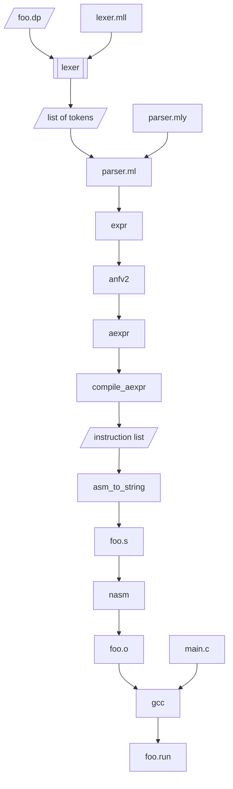

Diagram of our compiler so far.

```mermaid
flowchart TD
in[/foo.dp/]
 -->
lexer[[lexer]] 
 -->
tok[/list of tokens/]
 -->
parser.ml
 -->
expr
 -->
anfv2
 -->
aexpr
 -->
compile_aexpr
 -->
inst[/instruction list/]
 -->
asm_to_string
 -->
foo.s
 -->
nasm
 -->
foo.o
 -->
gcc
 -->
foo.run
mll[lexer.mll] --> lexer
mly[parser.mly] --> parser.ml
main.c --> gcc
```
